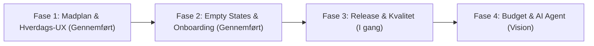

# Skafferiet — Produkt & Udviklings-Roadmap

Dette roadmap forener den overordnede vision for **Skafferiet** med behovene hos vores primære persona: **den travle børnefamilie og den sundhedsbevidste forbruger**. Målet er at reducere hverdagens mentale overload og skabe ro ("Kitchen Harmony") omkring madplanlægning, indkøb og sundhed.

---

## 🧭 Overblik over Faser

---

## 🥗 Fase 1: Madplan & Hverdags-UX (Gennemført)
*Fokus: Gøre den daglige brug så gnidningsfri som muligt for familien.*

- [x] **Kalorie-sum badge ved dagsoverskriften**:
  - Automatisk summering af dagens måltider (Morgenmad, Frokost, Aftensmad, Snack).
  - Stilrent, afdæmpet badge ved siden af dagsoverskriften (f.eks. `🔥 1.850 kcal`) i `AppColors.secondaryFixed`.
  - Tooltip ved tryk, der forklarer beregningen ud fra tilknyttede opskrifter.
- [x] **"Tilføj til indkøb" på Direct Entry / Hurtige måltider**:
  - 1-klik overførsel af manuelle måltider/snacks direkte på indkøbslisten med `source: 'meal_plan'`.
  - Optimistisk feedback med grønt flueben og deaktivering for at forhindre utilsigtede dubletter.

---

## 🎨 Fase 2: Empty States & Onboarding (Gennemført)
*Fokus: Skabe en varm, tryg og værdiskabende førstegangsoplevelse.*

- [x] **Konsekvent Empty State i hele appen**:
  - `EmptyStateWidget` implementeret på **Indkøbsliste** (både tom liste og filtrerede kategorier) med handlingsknapper til at tilføje varer eller nulstille filtre.
  - `EmptyStateWidget` implementeret på **Opskrifter** (både tom samling og nul søgeresultater) med 1-klik knap til "Nulstil søgning og filter" eller "Opret opskrift".
- [x] **Den Personlige Setup-Wizard (Onboarding)**:
  - **Trin 1 (Hvem spiser med?)**: Navngivning af husstand samt 44x44 dp tilgængelige steppers for voksne og børn med dynamisk portionsvisning (sikret mod < 1 person).
  - **Trin 2 (Familiens madstil)**: Flervalg af kostpræferencer (valgfrit).
  - **Trin 3 (Aftensmad til i aften)**: Vælg mellem 3 starter-opskrifter eller skriv eget måltid (med autofokus og validering), samt mulighed for at springe over.
  - **Instant Value & Landing**: Opretter automatisk måltid i dagens madplan og overfører ingredienser til indkøbslisten; afslutter med en varm velkomst-snackbar.

---

## 🚀 Fase 3: Play Store Release & Kvalitet (I gang)
*Fokus: Teknisk robusthed, stabilitet og overholdelse af Play Store krav.*

- [x] **Offline-fejlhåndtering**:
  - Detektering af netværksforbindelse (`connectivity_plus`).
  - Diskret offline-banner over bundnavigationsbaren med Kitchen Harmony styling, automatisk overgang og "Forbindelse genoprettet" notifikation.
- [x] **R8 / Minifikation**:
  - Minifikation og ressource-shrinking aktiveret i `android/app/build.gradle.kts`.
  - ProGuard-regler i `android/app/proguard-rules.pro` — linjenumre bevaret til brugbare crash-rapporter, Play Core undertrykt.
  - App bundle reduceret fra 49,3 MB til 46,5 MB. Verificeret på emulator: Firebase initialiserer, UI renderer, ingen fatale fejl.
- [x] **Signing config**:
  - Release-builds læser nøgleoplysninger fra git-ignored `android/key.properties`, med fallback til debug-nøgler og en tydelig advarsel i byggeloggen.
  - Vejledning i [docs/SIGNING.md](docs/SIGNING.md). **Udestående:** selve upload-keystoren skal genereres — se den kritiske sektion i [PLAY_STORE_CHECKLIST.md](PLAY_STORE_CHECKLIST.md).
- [ ] **Branded Splash Screen**:
  - Rolig opstartsskærm med "Kitchen Harmony" logo og baggrundsfarve.
- [x] **Profilbillede & Personliggørelse**:
  - Mulighed for upload og fjernelse af profilbillede via `ProfileImageService`, kamera/galleri tilladelser, 3-vejs synkronisering (Storage, Auth og Firestore) samt avatarer i husstanden og app-baren.
- [ ] **Dark Mode** — *større end oprindeligt antaget*:
  - Ikke en toggle-opgave. Appen har hverken `darkTheme`, `ThemeMode` eller en toggle i dag, og 220 hårdkodede `AppColors`-opslag fordelt på 15 widget-filer omgår temaet helt.
  - Kræver mørkt farvesæt, oprydning af de 220 opslag til `Theme.of(context).colorScheme`, `ThemeMode`-provider med persistering (`shared_preferences` mangler) og først derefter en toggle.
  - Fuld analyse og trinplan: [docs/DARK_MODE.md](docs/DARK_MODE.md).

---

## 🔮 Fase 4: Langsigtet Vision (Budget & AI Shopping Assistant)
*Fokus: Intelligent assistance og økonomisk overblik for husholdningen.*

### 💰 1. Budgetstyring for Husstanden
- **Månedligt / Ugentligt madbudget**:
  - Sæt et målbudget for husstanden (f.eks. 4.500 kr./md.).
  - Indtastning af cirka-priser eller totaler på indkøbsture.
  - Visuel budget-måler på dashboardet (Grøn/Gul/Rød) for at holde madbudgettet i hverdagen.
- **Prisoverslag på madplan**:
  - Estimeret portionspris eller ugepris baseret på valgte opskrifter.

### 🤖 2. AI Shopping & Meal Assistant
- **Interaktiv Chat-agent i Skafferiet**:
  - En rolig, hjælpsom assistent direkte i appen (f.eks. tilgængelig fra indkøb eller madplan).
- **Kernefunktioner for AI Agenten**:
  - **"Tøm køleskabet" / Restemad**: Brugeren skriver *"Vi har spidskål, æg og lidt kyllingrester"* $\rightarrow$ Agenten foreslår en hurtig ret og kan tilføje manglende ingredienser til indkøbslisten.
  - **Budget-tilpasset madplan**: *"Lav en madplan til 4 personer for 500 kr. i denne uge med fokus på nemme børnevenlige retter."*
  - **Smart indkøbsliste-optimering**: Agenten opdager manglende basisting eller grupperer ingredienser efter supermarkedets afdelinger.
